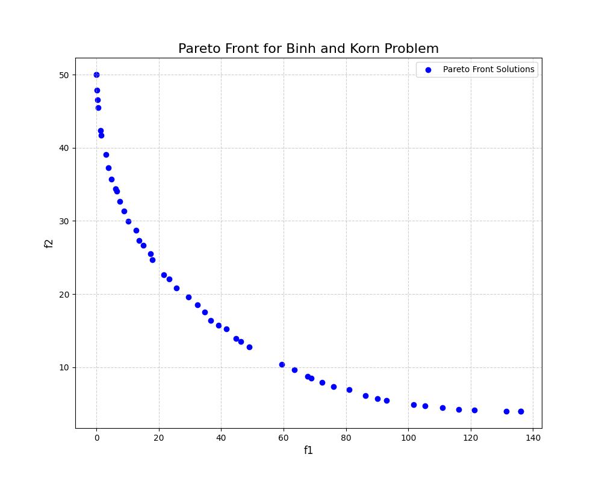

# Swarm
Black-box optimisation tool written in Rust. Clean API for solving complex single-objective and multi-objective optimisation problems using powerful metaheuristic algorithms. Swarm has the following features:
- NSGA-II for single/multi-objective problems.
- Particle Swarm Optimisation (PSO) for single-objective problems.
- Optional Parallel Execution (massively improves performance for expensive blackbox functions).
- Implicit handling of initialisation strategies (Latin Hypercube).
- Flexible Function Support:
    - Serial Mode: Accepts standard FnMut closures, allowing your objective function to maintain an internal state.
    - Parallel Mode: Requires thread-safe Fn + Sync + Send closures for safe, concurrent execution.

Note: All functions provided to Swarm must be of the signature: 
`FnMut(&[f64]) -> (Vec<f64>, Option<Vec<f64>>)`, where the first vector contains the objective values and the second vector contains the constraint values (if any). For parallel execution, the function must also be thread-safe (i.e., `Fn + Sync + Send`). Variable types are currently limited to f64.

## Getting Started
To use Swarm in your project, add it as a dependency in your Cargo.toml:

```toml
[dependencies]
swarm = "0.1.1"
```

To enable the high-performance parallel execution mode, add it with the parallel feature flag.

```toml
[dependencies]
swarm = { version = "0.1.1", features = ["parallel"] }
```

This is very useful for computationally expensive objective functions.

## Examples

### Single-Objective Optimisation with Particle Swarm
Problem: Minimise f(x, y) = (x² + y - 11)² + (x + y² - 7)²

```rust
use swarm::{error::Result, particle_swarm::PsoParams, Optimiser, Variable};

// Define the Himmelblau function
fn himmelblau_problem(x: &[f64]) -> (Vec<f64>, Option<Vec<f64>>) {
    let x1 = x[0];
    let x2 = x[1];
    let obj = (x1.powi(2) + x2 - 11.0).powi(2) + (x1 + x2.powi(2) - 7.0).powi(2);
    (vec![obj], None)
}

fn main() -> Result<(), Box<dyn std::error::Error>> {
    // 1. Define the search space for the variables
    let vars = vec![Variable(-5.0, 5.0), Variable(-5.0, 5.0)];

    // 2. Configure the optimiser
    let optimiser = Optimiser::ParticleSwarm {
        n_particles: 100,
        params: PsoParams::default(),
        constraint_handler: None,
        seed: None,
    };

    // 3. Solve the problem
    let max_iter = 200;
    let result = optimiser.solve(&mut himmelblau_problem, &vars, max_iter)?;

    // 4. Get the best solution found
    let best = result.best_solution().unwrap();
    println!("Min at x = {:.4?}, f(x) = {:.4}", best.x, best.f[0]);
    Ok(())
}
```

### Multi-Objective Optimisation with NSGA-II
This example solves the constrained Binh and Korn problem. NSGA-II is ideal for this as it finds a set of trade-off solutions, known as the Pareto Front, rather than a single point.

Problem: Minimise two objectives, f1(x, y) and f2(x, y), subject to two constraints.

```rust
use swarm::{Optimiser, Variable, SbxParams, PolyMutationParams, Initialisation};

// Define the Binh and Korn problem
fn binh_and_korn_problem(x: &[f64]) -> (Vec<f64>, Option<Vec<f64>>) {
    if x.len() != 2 {
        return (vec![f64::MAX, f64::MAX], None);
    }
    let x1 = x[0];
    let x2 = x[1];

    // Objectives
    let f1 = 4.0 * x1.powi(2) + 4.0 * x2.powi(2);
    let f2 = (x1 - 5.0).powi(2) + (x2 - 5.0).powi(2);

    // Constraints
    let g1 = (x1 - 5.0).powi(2) + x2.powi(2) - 25.0;
    let g2 = 7.7 - (x1 - 8.0).powi(2) - (x2 + 3.0).powi(2);

    (vec![f1, f2], Some(vec![g1, g2]))
}

fn main() -> Result<(), Box<dyn std::error::Error>> {
    // 1. Define the search space
    let vars = vec![Variable(0.0, 5.0), Variable(0.0, 3.0)];

    // 2. Configure the NSGA-II optimiser
    let optimiser = Optimiser::Nsga {
        pop_size: 50,
        crossover_params: SbxParams::default(),
        mutation_params: PolyMutationParams::default(),
        seed: None,
    };

    // 3. Solve the problem
    let result = optimiser.solve(&mut binh_and_korn_problem, &vars, 250)?;

    // 4. Get the Pareto front
    println!("Found {} solutions on the Pareto front.", result.solutions.len());
    
    Ok(())
}
```

After running the Binh and Korn example and plotting the solutions, you should see a Pareto front similar to the one shown below.



## License
MIT License - See [LICENSE](LICENSE) for details.

## Support
If you'd like to support the project consider:
- Identifying the features you'd like to see implemented or bugs you'd like to fix and open an issue.
- Contributing to the code by resolving existing issues, I'm happy to have you.
- Donating to help me continue development, [Buy Me a Coffee](https://coff.ee/alexlovric)